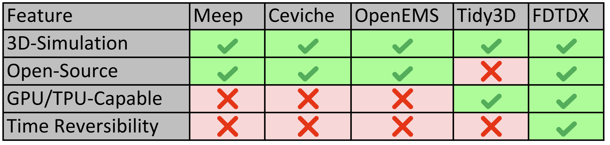

# Summary

The behavior of electromagnetic fields in complex media and structures under time-varying conditions leads to the propagation, scattering, and interaction of electromagnetic waves across diverse environments. 
The temporal and spatial evolution of these fields is essential to understanding wave phenomena, antenna design, or photonic devices.
Aside from analytical solutions for simple geometries, the majority of practical problems require robust numerical methods such as the finite-difference time-domain (FDTD) method for discretizing Maxwell's equations in both space and time.
FDTDX is an efficient implementation of the FDTD method with GPU acceleration through the JAX framework.
It provides a simple user interface for specifying a simulation scene as well as a suite of tools for inverse design.

# Statement of Need

FDTDX implements the FDTD algorithm, which aims to simulate maxwell's equations $\frac{\partial H}{\partial t} = - \frac{1}{\mu} \nabla \times E$ and $\frac{\partial E}{\partial t} = \frac{1}{\epsilon} \nabla \times H$, where $E$ and $H$ are the electric and magnetic field components.
This algorithm has been used in a number of research applications, for example in the field of photonic integrated circuits [@augenstein2020inverse], optical computing [@mahlau2025multi] or quantum computing [@larsen2025integrated].

The FDTD algorithm has been well known for a long time and a number of open-source packages already implement it.
However, most previous packages implement the algorithm only for CPU, which misses out on massive speedups through GPU acceleration.
Additionally, the implementation of the FDTD algorithm in JAX allows for automatic differentiation using a specialized algorithm based on the time reversibility of Maxwell's equations [@schubertmahlau2025quantized].
In contrast to the adjoint method, the gradient computation based on time reversibility can calculate a gradient through the time domain without the need to save electric and magnetic field after every time step.
This enables memory efficient inverse design, i.e. topological optimization of optical components using gradient descent.

A non-exhaustive list of FDTD implementations must include the popular Meep [@meep], which was developed almost 20 years ago for execution on CPU and is still widely used today.
Other frameworks for CPU only execution include OpenEMS [@openEMS], fdtd [@fdtd_laporte] and Ceviche [@ceviche].
Existing open-source packages that support execution on GPU are Khronos [@khronos] and FDTD-Z [@fdtdz], but both package are not maintained.
Additionally, there exist various commercial implementations of FDTD.
Notably, Tidy3D [@tidy3d] is an extremely fast commercial software due to its GPU acceleration.
A comparison between the different software frameworks can be seen in \autoref{comparison}.

<!-- | Feature | Meep | Ceviche | openEMS | Tidy3D | FDTDX |
|---------|------|---------|---------|--------|-------|
| 3D-Simulation | yes | yes | yes | yes | yes |
| Open-Source | yes | yes | yes | no | yes |
| Time Reversibility | no | no | no | no | yes |
| GPU/TPU-capable | no | no | no | yes | yes | -->

<!-- +-------------------+------------+----------+----------+----------+----------+
| Feature           | Meep       | Ceviche  | openEMS  | Tidy3D   |FDTDX     |
|                   |            |          |          |          |          |
+:=================:+:==========:+:========:+:========:+:========:|:========:|
| 3D-Simulation     | yes        | yes      | yes      | yes      | yes      |
+-------------------+------------+----------+----------+----------+----------+
| Open-Source       | yes        | yes      | yes      | no       | yes      |
+-------------------+------------+----------+----------+----------+----------+
| Time Reversibility| no         | no       | no       | no       | yes      |
+-------------------+ -----------+----------+----------|----------+----------+
| GPU/TPU-capable   | no         | no       | no       | yes      | yes      |
+===================+============+==========+==========+==========+==========+
| Table 1: Feature Comparison between different FDTD Software frameworks     |
+============================================================================+ -->

# Implementation 

As the name suggests, the Finite-Difference Time-Domain (FDTD) algorithm discretizes Maxwell's equations in space and time.
To compute the curl operation efficiently using only a single finite difference, the electric and magnetic fields are staggered in both space and time according to the Yee grid [@kaneyeeNumericalSolutionInitial1966].
Given an initial electric and magnetic field, the fields are updated in a leapfrog pattern.
Firstly, the electric field is updated based on the magnetic field.
Afterwards, the newly computed electric field is used to update the magnetic field.
The staggering through the yee grids makes these updates very efficient, but as a consequence fields need to be interpolated for accurate measurements.
In FDTDX, physical values can be measured through different detectors, which automatically implement this interpolation.

To inject light into the simulation, the Total-Field Scattered-Field (TFSF) [@taflove] formulation of a source is used in FDTDX. 
This formulation allows injecting light in a single direction into the simulation.
In contrast, a naive additive source implementation would emit light in both directions perpendicular to the injection plane.

To prevent unwanted reflections at the boundary of the simulation volume, there exist two different boundary conditions in FDTDX.
Firstly, a periodic boundary can be used to wrap fields around the simulation volume and automatically inject them on the other side of the volume.
This is useful for simulating large repeating areas through a single unit cell, for example in metamaterials [@metamaterial].
Secondly, reflections can also be prevented by using an absorbing boundary condition, implemented in the form of convolutional perfectly matching layers [@cpml].

In FDTDX, the specification of a simulation is simplified by the implementation of a constraint system.
The position and size of sources, detectors or any other simulation objects can be specified using relative constraints.
For example, it might make sense to position a detector next to a source for measuring the input energy in the simulation.
If both detector and source are placed independently, then moving one of the objects requires also moving the other.
With two objects this is manageable, but with more objects such adaptation quickly become a burden.
In contrast, in FDTDX the position between objects can be specified relative to each other.
Consequently, if one of the object is moved, the other object automatically moves as well.
Additionally, FDTDX implements utility functions to easily plot a visualization of the simulation scene.
Such a visualization can be seen in \autoref{setup}.
Similarly, plotting functions for detectors are implemented to visualize the results of a simulation in form of an image or video.

<!--  -->
\begin{figure}[h]
\centering
\includegraphics{img/setup.png}
\caption*{**Figure 1** Visualization of a simulation scene using the fdtdx.plot_setup function.\label{setup}}
\end{figure}

# Limitations and Future Work

At the time of publication, FDTDX only supports simulation of linear, non-dispersive materials. 
In the future, an implementation of dispersive material models [@taflove] is planned.
Simulating non-linear materials is a difficult taks, which we would like to tackle, but will require significant effort.
Additionally, lossy materials are currently only partially supported.

# Further Information

The full API and tutorials can be found at the FDTDX [documentation](https://ymahlau.github.io/fdtdx/). 
The source code is publicly available via the corresponding [Github respository](https://github.com/ymahlau/fdtdx).
Additionally, our conference paper on large-scale FDTD simulations [@mahlau2025flexible] gives a good introduction to FDTDX.

# Acknowledgements

We thank [Antonio Calà Lesina](https://www.hot.uni-hannover.de/de/calalesina), [Reinhard Caspary](https://www.phoenixd.uni-hannover.de/de/caspary) and [Konrad Bethmann](https://www.tnt.uni-hannover.de/de/staff/bethmann/) for helping us understand the physics behind Maxwell's equations and how to implement them within FDTD. 
Additionally, we acknowledge [Fabian Hartmann](https://www.tnt.uni-hannover.de/de/staff/hartmann/) for the initial idea of implementing a GPU accelerated FDTD algorithm.
Moreover, community contributions from [Marko Simic](https://github.com/msimicphysics), [Tianxiang Dai](https://github.com/txdai) and [Robin Giesecke](https://github.com/TheDarkchip) improved features of FDTDX.

This work was supported by the Federal Ministry of Education and Research (BMBF), Germany under the AI service center KISSKI (grant no. 01IS22093C), the Lower Saxony Ministry of Science and Culture (MWK) through the zukunft.niedersachsen program of the Volkswagen Foundation and the Deutsche Forschungsgemeinschaft (DFG) under Germany’s Excellence Strategy within the Cluster of Excellence PhoenixD (EXC 2122) and (RO2497/17-1). Additionally, this was funded by the Deutsche Forschungsgemeinschaft (DFG, German Research Foundation) – 517733257.

# References